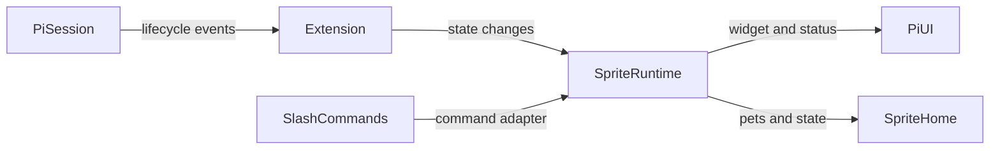
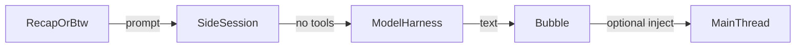

# pi-sprite Architecture

## Purpose

`pi-sprite` is a Pi extension package. It registers a small set of slash commands and lifecycle hooks, then keeps sprite rendering and footer status in a single runtime owner.

## Runtime Flow

The extension entrypoint is `extensions/index.ts`. It creates the sprite runtime, registers command groups, starts rendering on `session_start`, updates state during agent/tool events, and cleans up on `session_shutdown`.

## Component Boundaries

| Area | Owner | Notes |
|---|---|---|
| Extension lifecycle | `extensions/index.ts` | Registers Pi hooks and command groups |
| Sprite runtime | `src/sprite/runtime.ts` | Owns selected pet, visibility, timers, footer state, rendering, and cleanup |
| `/pet` and `/sprite` command adapter | `src/sprite/commands.ts` | Parses command arguments, bridges `/pet create` into the authoring skill, and calls the runtime interface |
| Pet imports | `src/sprite/loader.ts` | Validates local folders and ZIP imports before copying into sprite home |
| Pet manifest parsing | `src/sprite/manifest.ts` | Normalizes ids, validates sprite paths, and reads optional personality metadata |
| Rendering | `src/sprite/renderer.ts` | Converts images into ANSI, direct native images, or Kitty placeholder widgets |
| Context overlay | `src/context/index.ts` | Builds the token usage model and opens the TUI overlay |
| Recap | `src/recap/index.ts` | Generates compact recap text and displays it near the sprite |
| BTW recap bridge | `src/btw/recap.ts` | Generates a normal recap into the explicit BTW side thread |
| BTW side thread | `src/btw/index.ts` | Maintains explicit side conversations and injects only on user request |

## Side Sessions

`/recap`, `/btw`, and `/btw:recap` model work runs through isolated Pi side sessions first. The shared helper in `src/agent/side-session.ts` creates an in-memory session with no tools and a safety prompt, then disposes it after the response.

Hidden recap and BTW bookkeeping entries are filtered by `src/agent/session-entries.ts` so side work does not enter main model context unless `/btw:inject` or `/btw:summarize` explicitly sends it. `/btw:recap` appends the generated recap to the BTW thread and keeps it out of the main thread until that explicit injection step.

## Package Boundary

The package surface is declared in `package.json`: Pi loads `extensions/index.ts` and discovers skills under `skills/`. The `files` list controls what ships in `npm pack`, so package, skill, and example changes should be validated through `tests/skill.test.ts` and `tests/e2e/package-smoke.mjs`.
