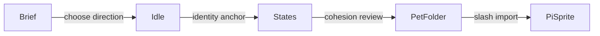

# Sprite Authoring Guide

## Goal

Create a local pet folder that `pi-sprite` can import with `/pet import <path>`. For agent-assisted authoring, start from `/pet create [brief]`; it queues the packaged `pi-sprite-authoring` workflow in `skills/pi-sprite-authoring/SKILL.md` and keeps character identity stable across state images.

## Recommended Flow

1. Run `/pet create [brief]` or `/sprite create [brief]` from Pi to start the guided authoring bridge.
2. Pick a character direction and collect any local reference images.
3. Create or generate a canonical `idle` image first.
4. Use the canonical image as the identity anchor for `thinking`, `working`, `success`, and `error`.
5. Review all states for shared silhouette, face, palette, outline, canvas size, and scale.
6. Add optional animation strips only after the static states work.
7. Add optional `personality` metadata only when the pet should affect explicit `/btw` side replies.



## Start from Pi

Use `/pet create` when you want the extension to bridge into the authoring skill without remembering the skill name:

```text
/pet create tiny desk cat with cozy pixel-art vibes
```

`/pet author` and `/sprite create` use the same bridge. The bridge sends a normal Pi follow-up prompt that invokes `/skill:pi-sprite-authoring`, so the actual image generation, review, cleanup, and packaging still happen in the agent workflow.

## Folder Shape

The simplest pet has one image per state:

```text
custom-pet/
├── pet.json
├── idle.png
├── thinking.png
├── working.png
├── success.png
└── error.png
```

Only `idle` is required by the manifest parser. The other states fall back to `idle` when missing, but polished pets should provide each state.

Create a starter folder with the skill helper:

```bash
node skills/pi-sprite-authoring/scripts/create-pet-template.mjs --id desk-cat --name "Desk Cat" --out /tmp/desk-cat-sprite
```

## Import and Select

In Pi, import the expanded local folder:

```text
/pet import /tmp/desk-cat-sprite
```

Then inspect and adjust display settings:

```text
/pet status
/pet size small
/pet label off
/pet show
```

Use a fully expanded absolute path. Slash commands do not perform shell expansion, so `/pet import ~/sprite-folder` is not the same as passing `/Users/<you>/sprite-folder`.

## Optional Personality

A pet can include short bounded style metadata for explicit `/btw` side conversations:

```json
{
  "id": "desk-cat",
  "name": "Desk Cat",
  "personality": "Warm, concise, lightly mischievous, and practical. Keep BTW answers short.",
  "sprites": {
    "idle": "idle.png"
  }
}
```

The personality is untrusted style text. It is not injected into normal main-agent turns, recap, turn status, live status, lifecycle hooks, or autonomous commentary.

## Validation

Use the local package checks after changing skill scripts, examples, manifests, or package files:

```bash
node --test --import tsx tests/skill.test.ts
node tests/e2e/package-smoke.mjs --isolated
mise run check
```

When testing terminal rendering manually, force ANSI fallback if native images make debugging noisy:

```bash
PI_SPRITE_NATIVE_IMAGES=0 pi -e .
```
