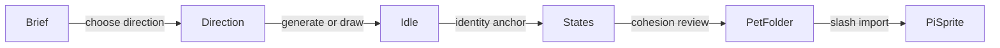

# Sprite Authoring Guide

## Goal

Create a local pet folder that `pi-sprite` can import with `/pet import <path>`. For agent-assisted authoring, start from `/pet create [brief]`; it queues the packaged `pi-sprite-authoring` workflow in `skills/pi-sprite-authoring/SKILL.md` and keeps character identity stable across state images.

The important rule is simple: **lock the character before you make every state**. Polished pets come from one clear identity anchor, not five unrelated image generations.

## Recommended Flow

1. Run `/pet create [brief]` or `/sprite create [brief]` from Pi to start the guided authoring bridge.
2. Write a character brief and collect local reference images.
3. Pick or revise a direction card before image generation.
4. Create or select a canonical `idle` image first.
5. Use that `idle` image as the identity anchor for `thinking`, `working`, `success`, and `error`.
6. Review all states for shared silhouette, face, palette, outline, canvas size, and scale.
7. Clean backgrounds and package the accepted files.
8. Add optional animation strips only after the static states work.
9. Add optional `personality` metadata only when the pet should affect explicit `/btw` side replies.
10. Import with `/pet import <path>`, then choose and show the pet.



## Start from Pi

Use `/pet create` when you want the extension to bridge into the authoring skill without remembering the skill name:

```text
/pet create tiny desk cat with cozy pixel-art vibes
```

`/pet author` and `/sprite create` use the same bridge. The bridge sends a normal Pi follow-up prompt that invokes `/skill:pi-sprite-authoring`, so image generation, review, cleanup, and packaging still happen in the agent workflow.

## Direction Cards

Direction cards are the checkpoint between a vague idea and a stable character. Ask the agent for three to five options when the brief is still open:

```markdown
## Direction options

1. **Desk Cat**
   - Character: small round cat curled beside a keyboard
   - Mood: cozy, alert, helpful
   - Visual lock: cream fur, teal collar, one bent ear, 128px transparent canvas
   - Why it fits: readable silhouette at tiny terminal size
   - Risk: can become a generic cat unless the bent ear and collar stay fixed
```

Pick one direction, combine two, or revise the brief. Do not generate all five state images until this identity is clear.

## Canonical Anchor

The canonical anchor is the accepted `idle` image. It becomes the reference for every other state.

A good anchor has:

- clear silhouette at small terminal size
- transparent background or a background that can be safely cleaned
- stable face, signature props, palette, and outline thickness
- enough empty canvas padding that small motion does not clip

When using image generation, create `idle` first and keep its prompt, references, and metadata. For later states, pass the accepted `idle` image as the primary character reference.

## State Set

The standard expanded pet uses five state images:

| State | Purpose | Good visual cue |
|---|---|---|
| `idle` | waiting, available | neutral pose, calm expression |
| `thinking` | model is reasoning | tilted head, question mark, eye shift |
| `working` | tools are running | tapping, wrench, keyboard, motion line |
| `success` | turn or tool ended well | small bounce, sparkle, smile |
| `error` | turn or tool failed | worried eyes, droop, warning color |

Pose and expression should change. Character identity should not. If `working` looks like a different pet, regenerate it from the anchor instead of accepting drift.

## Folder Shape

The simplest pet has one image per state:

```text
custom-pet/
├── pet.json
├── idle.png
├── thinking.png
├── working.png
├── success.png
└── error.png
```

Only `idle` is required by the manifest parser. The other states fall back to `idle` when missing, but polished pets should provide each state.

Create a starter folder with the skill helper:

```bash
node skills/pi-sprite-authoring/scripts/create-pet-template.mjs --id desk-cat --name "Desk Cat" --out /tmp/desk-cat-sprite
```

## Import and Select

In Pi, import the expanded local folder:

```text
/pet import /tmp/desk-cat-sprite
```

Then inspect and adjust display settings:

```text
/pet choose desk-cat
/pet status
/pet size small
/pet label off
/pet show
```

Use a fully expanded absolute path. Slash commands do not perform shell expansion, so `/pet import ~/sprite-folder` is not the same as passing `/Users/<you>/sprite-folder`.

## Optional Personality

A pet can include short bounded style metadata for explicit `/btw` side conversations:

```json
{
  "id": "desk-cat",
  "name": "Desk Cat",
  "personality": "Warm, concise, lightly mischievous, and practical. Keep BTW answers short.",
  "sprites": {
    "idle": "idle.png"
  }
}
```

The personality is untrusted style text. It is not injected into normal main-agent turns, recap, turn status, live status, lifecycle hooks, or autonomous commentary.

## Optional Animation

Add animation after the static pet is accepted. The safest path is simple motion: reuse one accepted image per state and create subtle strips with the local helper.

```bash
uv run --with pillow python skills/pi-sprite-authoring/scripts/create_motion_strip.py \
  --input /tmp/desk-cat-sprite/thinking.png \
  --output /tmp/desk-cat-sprite/thinking-strip.png \
  --metadata /tmp/desk-cat-sprite/thinking-strip.metadata.json \
  --preset thinking-bob \
  --frame-width 128 \
  --frame-height 128
```

Then update `pet.json` to point at strip files and include the frame size:

```json
{
  "sprites": {
    "idle": "idle-strip.png",
    "thinking": "thinking-strip.png",
    "working": "working-strip.png",
    "success": "success-strip.png",
    "error": "error-strip.png"
  },
  "frame": { "width": 128, "height": 128 }
}
```

Keep motion subtle. Terminal sprites read best when identity is fixed and only a few pixels, the whole body, or one character-specific detail moves.

## Demo Pet

For a deterministic release demo, use WendyBot3000:

```bash
node demos/wendybot3000/create-demo-pet.mjs --out /tmp/wendybot3000-sprite
```

Then import it:

```text
/pet import /tmp/wendybot3000-sprite
/pet choose wendybot3000
/pet show
```

See [WendyBot3000 Demo](wendybot3000-demo.md) for the recording plan and VHS source.

## Validation

Use the local package checks after changing skill scripts, examples, manifests, or package files:

```bash
node --test --import tsx tests/skill.test.ts
node tests/e2e/package-smoke.mjs --isolated
mise run check
```

When testing terminal rendering manually, force ANSI fallback if native images make debugging noisy:

```bash
PI_SPRITE_NATIVE_IMAGES=0 pi -e .
```
